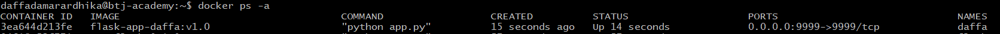
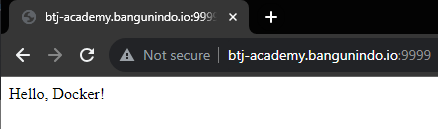
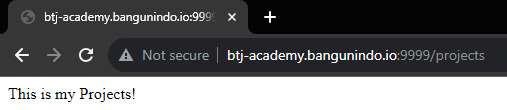
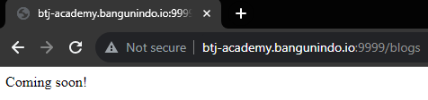

## Task 2 Ansible - 28 November 2023

### 1. Buat python app dan tambahkan beberapa routing kemudian custom port yang di-listen (Default 5000)
[app.py](flask/app.py)
```python
from flask import Flask
app = Flask(__name__)

@app.route('/')
def hello_world():
    return 'Hello, Docker!'

@app.route('/projects')
def projects():
    return 'This is my Projects!'

@app.route('/blogs')
def blog():
    return 'Coming soon!'

if __name__ == '__main__':
    app.run(debug = True, host='0.0.0.0')
```

[Dockerfile](flask/Dockerfile) untuk remote server

```dockerfile
FROM python:3.9-alpine

WORKDIR /app

COPY . .

RUN pip install -r requirements.txt

CMD ["python", "app.py"]
```
### 2. Buatlah 1 playbook dengan beberapa task yaitu:
1. Menyalin file dari local ke server bj-academy
2. Build docker image untuk python app
3. Jalankan container yang sudah di build

[playbook.yaml](playbook.yaml):
```yaml
- name: Task 2 Ansible - Daffa
  hosts: btj-academy
  become: true
  tasks:
    - name: Copy files inside flask folder to remote server
      copy:
        src: "./flask/"
        dest: "/home/daffadamarardhika/ansible_task2"

    - name: Build docker image
      community.docker.docker_image:
        name: "flask-app-daffa"
        tag: "v1.0"
        build:
          path: "/home/daffadamarardhika/ansible_task2"
        source: build

    - name: Run docker container
      docker_container:
        name: "daffa"
        image: "flask-app-daffa:v1.0"
        interactive: true
        tty: true
        ports:
          - "9999:9999"
```
[inventory.yaml](inventory.yaml):
```yaml
all:
  hosts:
    btj-academy:
      ansible_host: 10.184.0.100
```


### Menjalankan ansible
1. Buat Dockerfile di lokal untuk menjalankan ansible di docker di dalam direktori yang sama dengan `inventory.yaml` dan `playbook.yaml`
```dockerfile
FROM python:3.9-alpine

RUN apk update && apk add build-base libffi-dev

RUN pip3 install ansible

COPY . .
```
2. Build docker image, dan jalankan sebagai container
```bash
docker build -t ansible .
docker run -it -d -v C:/Users/daffa\.ssh\:/root/.ssh/ --name ansible2 ansible-2
```
3. Masuk ke container yang sudah di-run, lalu install openssh di dan ubah izin untuk ssh key
```bash
docker exec -it ansible2 sh
apk add openssh
chmod -R 400 /root/.ssh/id_rsa*
```
4. Jalankan ansible
```bash
ansible-playbook -i inventory.yaml playbook.yaml --user daffadamarardhika
```
5. Masuk ke SSH dan verifikasi apakah file sudah tercopy, image sudah dibuat, dan container sudah dijalankan atau belum
```bash
ssh daffadamarardhika@btj-academy.bangunindo.io
ls ../ansible-task2
docker ps -a | grep flask-app-daffa
```


Route yang dihasilkan:
- http://btj-academy.bangunindo.io:9999/ \
 
- http://btj-academy.bangunindo.io:9999/projects \

- http://btj-academy.bangunindo.io:9999/blogs \
